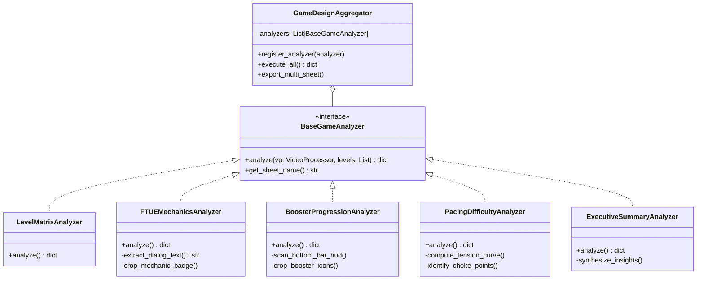

# 🎯 LỘ TRÌNH TRIỂN KHAI BỘ PHÂN TÍCH GAME DESIGN CHUYÊN SÂU (GAME DECONSTRUCTION SUITE)

Hệ thống được thiết kế theo tiêu chuẩn kiến trúc **SOLID**, tách biệt rõ ràng các tầng (Separation of Concerns), hướng giao diện (Interface-based), dễ dàng mở rộng cho mọi thể loại game (Puzzle, Match-3, Physics, Merge, v.v.).

---

## 📌 BẢNG CHECKLIST MILESTONES

- [x] **Milestone 1: Khung Kiến Trúc SOLID & Multi-Tab Google Sheet Exporter**
  - [x] Thiết kế `BaseAnalyzer` và phân rã các module theo Single Responsibility Principle (SRP).
  - [x] Xây dựng `GameDesignAggregator` điều phối các Analyzer độc lập (Open/Closed Principle).
  - [x] Nâng cấp Google Apps Script Webhook (`Code.js`) hỗ trợ sinh tự động nhiều tab: `Level Matrix`, `Mechanics & FTUE`, `Boosters & Unlocks`, `Pacing & Difficulty`.
  - [x] Triển khai phiên bản GAS mới qua Clasp và kiểm thử xuất dữ liệu mẫu đa tab.

- [x] **Milestone 2: Module Trích Xuất Hướng Dẫn & Cơ Chế Mới (FTUE & Mechanics Analyzer)**
  - [x] Tích hợp bộ đọc văn bản Computer Vision / OCR để trích xuất text trong hộp thoại hướng dẫn (`detect_modal_dialog`).
  - [x] Xây dựng thuật toán phân loại: *Forced Tutorial* (bàn tay chỉ dẫn) vs *Contextual Hint*.
  - [x] Tự động định vị màn đầu tiên xuất hiện cơ chế/chướng ngại vật mới (Mechanic Introduction).
  - [x] Xuất dữ liệu kèm ảnh chụp cơ chế sang Tab **`Mechanics & FTUE`**.

- [x] **Milestone 3: Module Phân Tích Mở Khóa Vật Phẩm Bổ Trợ (Booster & Feature Unlock Analyzer)**
  - [x] Xây dựng ROI Scanner quét thanh công cụ dưới đáy màn hình (Bottom HUD Bar).
  - [x] Nhận diện trạng thái icon: 🔒 *Locked (kèm số level mở khóa)* vs 🔓 *Unlocked*.
  - [x] Tự động crop icon vật phẩm (Vợt Net, Cọ Clear, Extra Slot...) và mapping với thời điểm mở khóa.
  - [x] Xuất dữ liệu chi tiết sang Tab **`Boosters & Unlocks`**.

- [x] **Milestone 4: Module Phân Tích Đường Cong Nhịp Độ & Điểm Nghẽn (Pacing & Difficulty Curve)**
  - [x] Tính toán chỉ số Pacing: Tốc độ hoàn thành (Completion Time), Mật độ phần tử (Board Density), Nhịp căng thẳng & thả lỏng (Tension & Release).
  - [x] Tự động xác định các điểm nút thắt (Choke Points / Paywalls) - nơi người chơi dễ bỏ cuộc hoặc phải nạp tiền/xem quảng cáo.
  - [x] Tạo biểu đồ tiến trình thời lượng và độ khó nhúng trực tiếp vào Google Sheet (Tab **`Pacing & Difficulty`**).

- [x] **Milestone 5: Module Tổng Kết & Đề Xuất Cân Bằng Game (Executive Summary & GD Insights)**
  - [x] Xây dựng bộ quy tắc chuyên gia (Rule-based GD Heuristics) đánh giá tổng quan game.
  - [x] Tự động tổng hợp: Số lượng màn, Độ dài trung bình, Tần suất xuất hiện tính năng mới, Điểm mạnh / Điểm yếu thiết kế của đối thủ.
  - [x] Tạo bảng đúc kết bài học thực chiến cho đội ngũ làm game sang Tab **`Executive Summary`**.

- [x] **Milestone 6: Tích Hợp Toàn Diện, Nâng Cấp Web Dashboard & Đồng Bộ Git**
  - [x] Tích hợp toàn bộ pipeline vào endpoint API backend (`/api/project/<name>/analyze`).
  - [x] Nâng cấp giao diện Web Localhost hỗ trợ xem trước các Tab phân tích GD dạng thẻ/bảng.
  - [x] Chạy kiểm thử End-to-End thực tế trên video `FishSortPuzzle`.
  - [x] Đồng bộ toàn bộ mã nguồn lên GitHub Repo `tinycorn-studio/Game-Analytics`.

---

## 🏛️ THIẾT KẾ KIẾN TRÚC HỆ THỐNG (SOLID PRINCIPLES)

