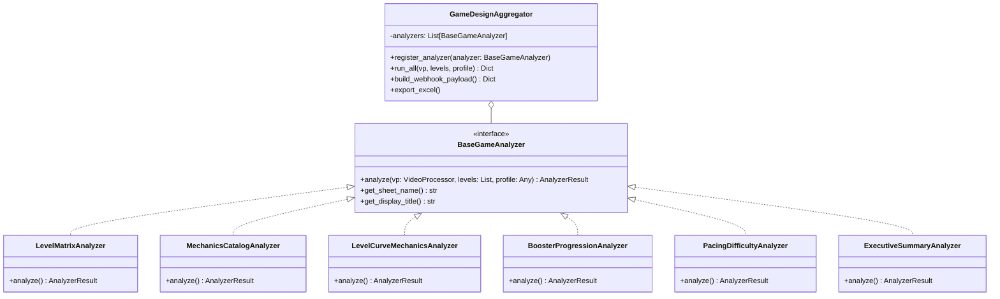
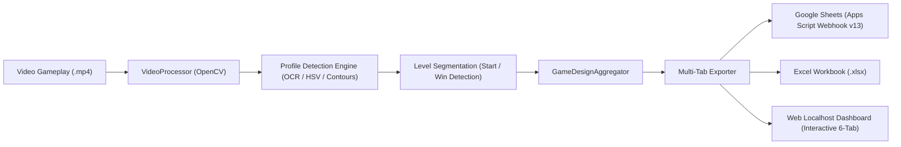

# 🏛️ HƯỚNG DẪN KIẾN TRÚC HỆ THỐNG PHÂN TÍCH GAME CHUYÊN SÂU
## (GENERALIZED HYBRID PUZZLE DECONSTRUCTION ENGINE)

Tài liệu này mô tả chi tiết toàn bộ kiến trúc, nguyên lý thiết kế, quy trình bóc tách (deconstruction pipeline) và khả năng mở rộng của hệ thống **Game Level Deconstructor**. Hệ thống được thiết kế theo tiêu chuẩn công nghiệp **SOLID** nhằm phân tích chuyên sâu mọi tựa game thuộc thể loại **Hybrid Puzzle / Casual Puzzle** (ví dụ: *Fish Sort Puzzle*, *Screw Jam*, *Triple Match 3D*, *Bus Jam*, *Royal Match*, *Match Factory*...).

---

## 📌 1. NGUYÊN LÝ THIẾT KẾ CỐT LÕI (SOLID PRINCIPLES)

1. **Single Responsibility Principle (SRP)**: Mỗi Analyzer chỉ đảm nhiệm bóc tách 1 khía cạnh duy nhất của Game Design (Cơ chế, Tiến trình độ khó, Vật phẩm bổ trợ, Nhịp độ tâm lý, hay Tổng kết chiến lược).
2. **Open/Closed Principle (OCP)**: Thêm tựa game mới hoặc chỉ số mới bằng cách đăng ký thêm Analyzer kế thừa từ `BaseGameAnalyzer` hoặc tạo file `Profile` JSON mới mà không cần sửa đổi mã nguồn điều phối cốt lõi.
3. **Liskov Substitution Principle (LSP)**: Mọi Analyzer đều tuân thủ contract trả về đối tượng chuẩn hóa `AnalyzerResult`.
4. **Interface Segregation Principle (ISP)**: Tách biệt rõ ràng tầng quét thị giác máy tính (`VideoProcessor`), tầng nhận diện quy tắc game (`GameProfile`), và tầng phân tích Game Design (`BaseGameAnalyzer`).
5. **Dependency Inversion Principle (DIP)**: `GameDesignAggregator` phụ thuộc vào Interface trừu tượng `BaseGameAnalyzer`, không phụ thuộc vào các lớp cài đặt cụ thể.

---

## 📊 2. BỘ 6 BẢNG TÍNH GAME DESIGN CHUYÊN SÂU (6-TAB SUITE)

Hệ thống tự động sinh đồng bộ ra **Google Sheets** (nhúng ảnh và checkbox thật), file **Excel (.xlsx)** đa tab và hiển thị trực tiếp trên **Web Dashboard Localhost**:

| Tab | Tên Bảng Tính | Vai Trò Game Design | Nội Dung Bóc Tách Chi Tiết |
| :--- | :--- | :--- | :--- |
| **1** | **Level Matrix** | Ma Trận Màn Chơi | Ảnh bàn cờ khởi đầu (Board Start), ảnh chiến thắng (Victory), mốc thời gian bắt đầu - kết thúc, thời lượng giải thực tế. |
| **2** | **Mechanics Catalog** | Bách Khoa Toàn Thư Cơ Chế | **Design Bible**: ID, Tên cơ chế/chướng ngại vật (*Frozen Bubble, Lock & Key, Mystery Bubble, Target Tank...*), Level xuất hiện lần đầu, Quy tắc vận hành, Cách hóa giải (Counterplay), Ảnh crop icon và vật phẩm phụ. |
| **3** | **Level Curve & Mechanics** | Ma Trận Màn & Cơ Chế | **Progression & Balancing Matrix**: Cấp độ, Mã màn, Phân tầng Tier độ khó (*Normal / Hard [xanh] / Crazy [đỏ]*), Đánh dấu mốc mở khóa cơ chế mới (*Highlight xanh lá*), Mật độ phần tử (Bóng, Cá), và **Hệ thống Checkbox (☑/☐)** từng cột cơ chế cho thấy chiến lược xếp chồng chướng ngại vật (*Mechanic Stacking*). |
| **4** | **Boosters & Unlocks** | Trợ Thủ & Mở Khóa | Màn mở khóa item, Trạng thái (Khóa/Mở), Ảnh crop icon, Công dụng cứu nguy khẩn cấp (*Bailout Utility*), Đánh giá áp lực tiền tệ (*Monetization Pressure*). |
| **5** | **Pacing & Difficulty** | Nhịp Độ & Đường Cong Tâm Lý | Phân tích nhịp căng thẳng & thả lỏng (*Tension & Release*), Độ lệch chuẩn thời gian so với trung bình phiên chơi, Nhận diện điểm nghẽn ép nạp/xem Ads (*Choke Points / Paywalls*). |
| **6** | **Executive Summary** | Đúc Kết Chiến Lược Cho Studio | Tổng hợp chỉ số KPI cấp điều hành, Chu kỳ ra mắt tính năng mới, Đánh giá rủi ro người chơi bỏ cuộc (*Churn Risk*), Bài học áp dụng cho dự án nội bộ. |

---

## ⚙️ 3. QUY TRÌNH BÓC TÁCH COMPUTER VISION & OCR (PIPELINE)

1. **Phase 1: Quét Phân Đoạn Màn Chơi (Level Segmentation)**:
   - Dò tìm màn hình chiến thắng (*Victory Popups / Stars / Claim Button*) dựa trên profile hình học và màu sắc.
   - Nhận diện thời điểm chuyển giao bàn cờ (*Board Start Detection*) sau khi hoạt ảnh chào màn hoàn tất, chụp đúng trạng thái bàn cờ sạch tĩnh để làm dữ liệu thiết kế màn.
2. **Phase 2: Quét Văn Bản & Hộp Thoại (RapidOCR Engine)**:
   - Quét khung hình xung quanh thời điểm bắt đầu màn để phát hiện hộp thoại hướng dẫn tân thủ (FTUE Tooltips / Forced Tutorials).
   - Trích xuất toàn bộ text hướng dẫn và phân loại mức độ can thiệp (Bắt buộc chỉ tay vs Gợi ý ngữ cảnh).
3. **Phase 3: Quét Thanh Công Cụ Đáy Màn Hình (Bottom HUD Scanner)**:
   - Định vị dải tọa độ đáy chứa các slot bổ trợ (Boosters).
   - Nhận diện trạng thái ổ khóa (`🔒`) và số màn mở khóa kèm theo.
   - Tự động crop icon vật phẩm sạch lưu vào thư mục `boosters/`.
4. **Phase 4: Tổng Hợp & Đồng Bộ Đa Nền Tảng (Multi-Channel Sync)**:
   - **Google Sheets Webhook (v13)**: Hỗ trợ tự động xuống dòng (`Wrap text`), căn lề thông minh (căn trái cho diễn giải, căn giữa cho thông số), sinh checkbox tương tác và tô màu Tier trực quan.
   - **Excel Engine**: Xuất file `.xlsx` 6 tab hoàn chỉnh.
   - **Web Dashboard**: Cung cấp giao diện tương tác tức thì với cache-busting `?t=timestamp` cho hình ảnh.

---

## 🎮 4. HƯỚNG DẪN MỞ RỘNG CHO CÁC GAME HYBRID PUZZLE KHÁC

Hệ thống được thiết kế dạng **Plugin Profile** nên việc thêm game mới không yêu cầu sửa đổi code lõi:

1. **Bước 1: Tạo thư mục dự án**:
   - Tạo thư mục mới tại `projects/<Tên_Game_Mới>/`.
   - Đặt video quay màn hình vào `projects/<Tên_Game_Mới>/input_videos/`.
2. **Bước 2: Cấu hình Game Profile (`profiles/<Tên_Game_Mới>.json`)**:
   - Khai báo vùng quét OCR màn chơi (`level_roi`).
   - Khai báo ngưỡng màu chiến thắng (`victory_color_range`).
   - Khai báo tọa độ thanh vật phẩm đáy màn hình (`bottom_hud_roi`).
3. **Bước 3: Mở rộng danh mục cơ chế (nếu cần)**:
   - Cập nhật quy tắc nhận diện chướng ngại vật đặc thù trong `core/analyzers/mechanics_catalog_analyzer.py` hoặc tạo profile mechanics riêng cho game đó.
4. **Bước 4: Chạy phân tích**:
   - Sử dụng Web Dashboard hoặc gọi API `/api/project/<name>/analyze`.

---

## 🔒 5. QUY TẮC CẬP NHẬT TÀI LIỆU HỆ THỐNG (MANDATORY UPDATE RULE)

> [!IMPORTANT]
> **QUY TẮC BẮT BUỘC ĐỐI VỚI AI VÀ NHÀ PHÁT TRIỂN**:
> 1. Mỗi khi có bất kỳ sự thay đổi kiến trúc, thêm Analyzer mới, sửa đổi cấu trúc bảng tính, hoặc cập nhật phiên bản Google Apps Script, **BẮT BUỘC phải đồng bộ ngay lập tức vào file này (`SYSTEM_ARCHITECTURE_GUIDE.md`)** và đánh dấu tiến độ trong **`ROADMAP_MILESTONES.md`**.
> 2. Mọi cam kết mã nguồn (git commit) khi bàn giao tính năng mới phải đi kèm tài liệu kiến trúc cập nhật tương ứng.
